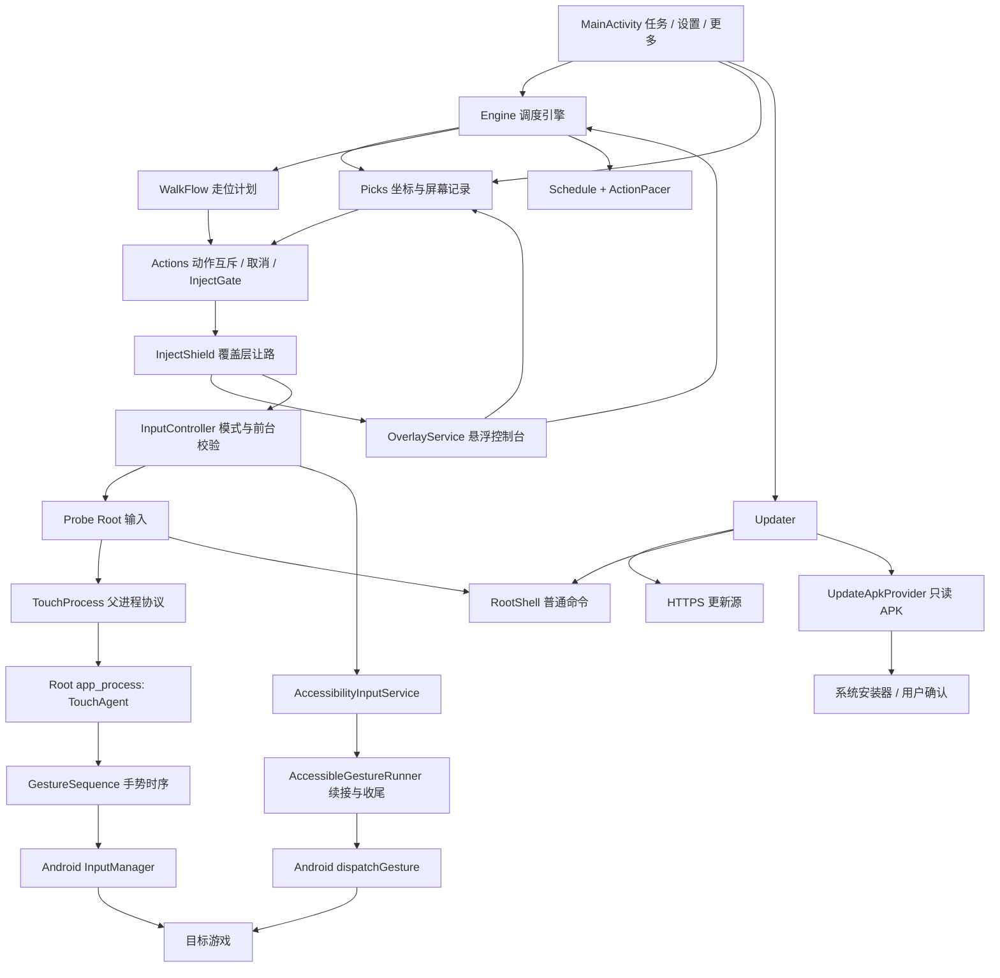

# 软件整体架构

本文依据 2026-09-26 的工作区源码，整理时版本元数据为 `0.28.6 / 52`（这批改动提交为 `0.29.0 / 53`）。描述当前结构及行为，不代表历史 APK、线上发布或真机验收结果。使用方法见 [主要功能](主要功能.md)，交付流程见 [版本更新与发布](版本更新与发布.md)。

## 1. 系统边界与技术栈

阿尔泰是单设备 Android 应用：用户手动标点，应用按时间表注入触摸。当前运行链路没有图像识别、云端任务编排、远程设备管理或业务数据库。游戏本身是外部系统，应用不读取角色位置、技能冷却或 BUFF 生效状态。

| 项目 | 当前实现 |
|---|---|
| Gradle 工程 / 模块 | `altair-buff` / `:probe` |
| 应用 ID / 命名空间 | `com.altair.probe` |
| Android SDK | `minSdk 26`、`targetSdk 30`、`compileSdk 33` |
| 构建工具 | Gradle Wrapper 8.2、Android Gradle Plugin 8.1.4、Kotlin 插件 1.9.22、JDK 17 |
| 界面 | 系统 `Activity`、`View`、`WindowManager`，布局用代码构建 |
| 并发 | `Thread`、主线程 `Handler`、锁及原子变量；没有协程框架 |
| 数据 | 本地 `SharedPreferences`、日志与更新缓存文件 |
| 依赖策略 | 没有显式声明的第三方业务/UI运行库；Kotlin 编译及运行仍依赖 Kotlin 标准库 |
| 输入能力 | Root：`app_process` + `InputManager`；无障碍：`dispatchGesture` + `continueStroke` |
| 外部网络 | 用户手动触发时访问 HTTPS APK 更新源 |

`MainActivity`、`OverlayService`、`AccessibilityInputService` 和 `UpdateApkProvider` 共用应用进程，没有独立 `android:process` 配置。Root 输入进程是运行时启动的子进程，不是另一个 APK 或 Gradle 模块。源码允许 API 26 及以上安装，主要验证目标为 Android 11/13；API 下限不等于所有设备均已验证。

## 2. 组件关系



图中 `Actions → InjectShield → InputController` 表示执行顺序，具体组合由 `Picks.tap` 和 `WalkFlow.strollAndJump` 中的回调完成。`ShellCore` 为界面、引擎提供共享的 `RootShell`、`Probe`、`Updater`，不另建服务进程。模式默认 Root，切换必须空闲且不清除安全闸门；动作失败不会自动换通道重放。

## 3. 源码职责

下面文件均位于 [应用源码目录](../probe/src/main/java/com/altair/probe)。

| 层次 | 文件 | 责任 |
|---|---|---|
| 主界面 | `MainActivity.kt`、`Ui.kt` | 设置编辑、准备清单、任务启停、更新与日志；原生控件和样式共用 |
| 悬浮交互 | `OverlayService.kt`、`PickView.kt` | 前台服务、球/面板、标注层、标点回显、通知与快捷停止、让路窗口恢复 |
| 任务调度 | `Engine.kt`、`Schedule.java`、`ActionPacer.java` | 每技能独立排期、独立走位周期、执行顺序、动作间隔、失败退避 |
| 坐标与动作计划 | `Picks.kt`、`ScreenGeometry.kt`、`ScreenBounds.java`、`WalkFlow.kt`、`WalkPlan.java` | 标点与迁移、显示屏一致性、可见区域计算、走位参数/坐标/预算校验 |
| 动作控制 | `Actions.kt`、`InjectGate.kt`、`RunResult.java`、`ActionFailure.java` | 全局动作锁、取消令牌、未知触摸状态阻断、分类结果与异常链归类 |
| 窗口让路 | `InjectShield.kt` | 注入前让路、动作后恢复的统一接口；具体窗口操作由悬浮服务实现 |
| 输入及 Root | `Probe.kt`、`TouchProcess.kt`、`TouchAgent.java`、`GestureSequence.java`、`RootShell.kt` | Root 授权、前台检查、子进程协议、事件注入、取消释放与普通命令 |
| 双输入适配 | `InputController.kt`、`TouchAction.java` | 模式持久化、前台入口、两种后端共用动作描述 |
| 无障碍 | `AccessibilityInputService.kt`、`AccessibleGestureRunner.java`、`ForegroundWindows.java` | 服务连接、窗口元数据判断、手势续接、回执及安全释放 |
| 自更新 | `Updater.kt`、`UpdateDownload.java`、`ApkSignerTrust.java`、`ApkFiles.java`、`UpdateApkProvider.kt` | 下载/文件选择、信任核对、Root 安装或系统确认安装 |
| 共享支撑 | `ShellCore.kt`、`LogBus.kt`、`Busy.kt`、`ActionGatePolicy.java` | 应用上下文与入口、内存日志、长操作反馈、设置草稿与外部变更冲突判断 |

这些是同一模块内的职责划分，并非已经拆成独立库。部分核心逻辑用 Java 编写，可与手写 Java 回归测试直接共用。

## 4. 生命周期与线程模型

`MainActivity` 初始化共享对象，订阅日志和长操作状态；在可见时每 500ms 刷新状态。离开 Activity 不会自动停止任务，Activity 销毁时主要解除监听与 UI 回调。

`OverlayService` 以带通知的前台服务运行，绑定 `InjectShield` 窗口操作，显示悬浮球。它每 250ms 更新倒计时，空闲时约每 2 秒通过后台线程查询前台包名、同步标点回显并尝试恢复窗口。执行动作时暂停这条空闲查询，由输入链路自行检查。通知提供停止入口。

服务采用 `START_NOT_STICKY`；其 `onDestroy` 会停止引擎、取消动作、解除让路绑定并移除窗口。没有开机启动接收器或持久化任务恢复机制。应用进程被杀后，计时状态和运行计数不会继续，重开后需要人工启动。

`Engine` 只有一个名为 `automation` 的 worker。技能与走位各有时钟，但在同一 worker 中串行执行；排期对象只由 worker 写入，界面读取 `volatile` 状态快照。时间调度使用 `SystemClock.elapsedRealtime()`，避免依赖设备墙上时钟。

所有手动、自动触摸共用 `Actions` 的 `ReentrantLock`。已有动作时新动作不会排队执行，而是明确返回未执行结果。停止通过取消令牌与线程中断通知，不需要等待动作锁；重新启动必须等旧 worker 完成收尾。`Busy` 用于更新、检查等长操作的反馈和界面门禁，不替代触摸动作锁。

## 5. 一次任务如何执行

### 5.1 启动与排期

1. `Engine.start` 检查是否已有任务、动作、长操作或标注过程，并检查注入安全闸门。
2. `Picks.required` 从启用的技能和走位开关生成必需位置；校验坐标及当前屏幕记录，再检查悬浮窗权限。
3. 启动悬浮服务及 worker；新启用的 `Schedule` 首次立即到期，但真正执行仍须等目标游戏在前台。
4. 每轮读取配置，更新四个技能排期与一个走位排期。都到期时先按槽位顺序补技能，再走位。
5. 动作成功后，以完成时刻加周期计算下次执行时间。它不是固定整点任务，也不追补离开游戏期间漏掉的所有轮次。

`Schedule` 用周期 `0` 表示禁用。技能普通失败后分别按 `30秒 × 连续失败次数` 排下次重试，同一槽位连续失败 3 次停止任务。走位中途失败会直接停止，避免从未知位置重新执行整段往返。危险结果“未确认松手”直接阻断后续输入。

`ActionPacer` 保留上次动作完成的类别和时刻：技能之间等待可配置间隔，技能与走位切换等待 `max(1000ms, 技能间隔)`。引擎将等待拆成最多 200ms 的片段，以响应停止。

### 5.2 技能与走位链路

技能：`Picks.tap → Actions.run → 坐标/屏幕校验 → InjectShield.aroundInject → InputController.perform`。一次点击按住 90ms；成功只说明输入链路完成。

走位：`WalkFlow.strollAndJump → Actions.run → WalkPlan → InjectShield.aroundWalk → InputController.perform`。左右推杆端点相对中心等幅，超过屏幕边界就拒绝执行，不单独裁剪端点。三段为左 `D`、右 `2D`、左 `D`，段间分别等待 250ms；标记跳跃时，再等 1000ms 并按跳跃键。

`WalkPlan` 计算实际动作预算和让路矩形。无跳跃预算为 `4D + 500ms`；有跳跃为 `4D + 1500ms + 跳跃按压时长`。这些是计划时长，实际还包含进程启动、系统注入与重试开销。走位不读取角色位置，只能近似回位。

### 5.3 Root 输入进程协议

`Probe.perform` 检查 Root、目标前台和屏幕后，通过 `su -c` 执行以下形式的命令，复用已安装 APK 内的类：

```text
CLASSPATH=<当前APK路径> app_process /system/bin com.altair.probe.TouchAgent <动作参数>
```

`TouchProcess` 向子进程标准输入写 `GO`，读取标准输出，并在等待中检查取消、超时与安全条件。等待以 40ms 为一个轮询片段；前台和屏幕安全检查约每秒安排一次，实际响应受系统查询耗时影响，不能当作瞬时保护。

`TouchAgent` 使用 `GestureSequence` 产生 DOWN/MOVE/UP，按同步完成模式调用 `injectInputEvent`。按住期间约每 16ms 发送 MOVE；发送失败有限重试，每个事件最多 3 次，间隔 40ms。每段手势保持一致的 `downTime`。

父进程取消时关闭标准输入，子进程看到 EOF 后取消动作并尝试松手。父进程默认给 2 秒清理窗口，超时强杀；动作总超时按计划预算加 10 秒检查。

| 协议信息 | 含义 |
|---|---|
| `TOUCH_OK` | 动作序列已执行完，不等于游戏已接受技能效果 |
| `TOUCH_IDLE` | 子进程报告当前没有未确认释放的触摸 |
| `TOUCH_RELEASE_FAILED` | 无法确认已松手，必须上报危险结果 |
| `TOUCH_JUMP_FAILED` | 可选跳跃的普通失败提示；仍需满足整条链路的释放检查 |
| `TOUCH_ERROR` / `TOUCH_CANCELLED` | 异常或取消详情 |

成功判定综合退出码 `0`、`TOUCH_OK` 和安全收尾。缺失 `TOUCH_IDLE`、清理强杀、读取线程未完成或明确释放失败，都不能当作成功。DOWN 被拒也可能已经部分送达，`TouchAgent` 因此保守记录未知触摸状态；不能把所有跳跃 DOWN 失败一概解释为可忽略。

普通 Root 查询和安装走 `RootShell`：每条命令独立启动 `su -c`，同步串行执行，分别处理输出、退出码和超时。`isAlive` 表示此前 Root 握手通过，不代表存在常驻 shell。触摸不占用这一命令通道，避免查询干扰手势时序。

## 6. 安全边界与错误传播

无障碍输入不启动 Root 子进程，使用同一 `TouchAction` 构造系统手势：初始推杆移动最多 30ms，之后每段最多 150ms，通过 `continueStroke` 保持同一手指，最后一段明确释放。每段等待回调，超时预算为片段时长加 1500ms；这不是系统响应的硬实时保证。停止时等当前回执后只做同一手指的收尾，取消或丢失回执则报告触摸状态未知。主线程提交与回执过期互斥，迟到任务不能在动作锁释放后发送。具体说明及测试见 [无障碍兼容与验收](无障碍兼容与验收.md)。

### 6.1 三种不同的限制

| 限制 | 负责组件 | 恢复方式 |
|---|---|---|
| 同一时刻只能有一个触摸动作 | `Actions` 动作锁 | 动作完成收尾后自动释放 |
| 触摸状态未知时禁止继续注入 | `InjectGate` | 用户确认游戏触摸已复位，且旧动作已收尾后解除；普通停止不解锁 |
| 覆盖层不得拦截自己的注入 | `InjectShield` + `OverlayService` | 动作前让路，动作后恢复；未恢复时拒绝新注入 |

`InjectGate` 是进程内状态，不写入磁盘；重启进程会丢失该状态，不能把它理解为持久化安全锁。

`ActionFailure` 检查异常的 `cause` 与 `suppressed` 链，优先识别 `RELEASE_UNKNOWN`，避免取消或原始动作异常掩盖松手失败。`RunResult` 将成功、取消、普通失败、危险失败及入口阻断传给引擎和界面。

### 6.2 前台、坐标与让路

Root 模式前台包名优先解析 `dumpsys window` 的焦点，无法确定时再查 `dumpsys activity activities`。无障碍模式查询当前窗口快照，只读取窗口所属包名和窗口状态；仅接受默认显示屏唯一且聚焦的应用窗口。应用须处于活动状态，或由可确认归属的自家非聚焦悬浮窗临时占用活动状态。拒绝分屏、画中画、输入法、其他活动/聚焦窗口、锁屏和息屏；无法确定返回空字符串。等待阶段目标不在前台时引擎进入 `PAUSED`；输入开始前以及输入期间再检查，错误沿动作结果传回。服务断开停止任务，重连不自动恢复。

标注与注入共用默认显示屏 `getRealSize` 和 rotation。记录与当前屏幕不同则要求重标；旧坐标缺屏幕记录时允许补记并记录日志。归一化坐标并不意味着跨分辨率、横竖屏可以直接复用。

让路分两档：

- `INJECT`：让面板、球、采点层不可触摸，保持几何位置。
- `WALK`：在不可触摸之外，把与注入区重叠的窗口临时缩成 `1×1` 并移到 `(0,0)`，在注入区外放置快捷停止按钮；没有可用停止区域就拒绝执行。

窗口修改回到主线程同步完成后才允许发输入。让路处理未绑定时默认等待，最多 8 秒后失败；窗口同步等待上限为 2 秒。让路恢复错误不会伪装为成功，悬浮服务保留快照与恢复状态，并在空闲轮询时尝试修复。

这些检查依赖 Android ROM、Root 实现和系统隐藏接口；离线测试不能证明所有云手机的窗口路由和触摸回执都正确。

## 7. 数据存储与迁移

| 存储 | 内容 / 生命周期 |
|---|---|
| `SharedPreferences: buff` | 槽位启用、`durSec0..3`、`buffGapMs`；兼容读取旧 `dur0..3` 分钟值 |
| `SharedPreferences: walk` | 走位开关、单程毫秒、周期分钟、屏宽幅度百分比、跳跃按压毫秒 |
| `SharedPreferences: picks` | 六类坐标键、对应 `${slot}_screen`、`migratedLegacy`；每项独立保存 |
| `SharedPreferences: overlay` | 目标包名、悬浮窗位置/显示等设置；保留部分旧迁移来源 |
| `SharedPreferences: updater` | 手工指定的 APK URL，不保存自动检查开关 |
| `SharedPreferences: input` | 手动选择的操作方式；缺省值为 Root |
| 更新待安装状态 | `updater` 中目标版本、摘要、系统安装日志；内部 `pending-update.apk` 在安装前复核，安装或丢弃前不覆盖 |
| 进程内状态 | 排期、运行计数、动作锁、注入闸门、`Busy` 与 `LogBus` 缓冲 |
| 应用文件 | 手工导出的 `altair_log.txt`；优先应用外部专属目录，否则内部 `filesDir` |
| 应用缓存 | 下载的 `update.apk`、本地更新暂存的 `local.apk` |
| `/data/local/tmp/` | 更新安装脚本 `altair_update.sh` 和更新日志 `altair_update.log` |

首次读取坐标会尝试从旧 `overlay/pickedPoints` 的前四项迁移技能位置，从旧 `market/joyCxMilli,joyCyMilli` 迁移轮盘。清空全部标记仍保留迁移完成标志，防止已删除坐标被重新搬回。

设置页与悬浮面板**写同一份** `SharedPreferences`，因此两处都能改走位开关与目标包名。主界面为此保留草稿基线：用户没有改过某一项时，外部修改会被直接同步到界面；用户改过而外部也变了时，提示冲突并拒绝保存旧值，避免静默覆盖（`ActionGatePolicy`、`MainActivity.syncExternalSettings`、`saveSettings`）。走位关闭时，走位参数输入被禁用且不参与保存校验，沿用已保存的数值。

会话级注入闸门（`InjectGate`）不落盘：它只在进程内有效，未确认松手后阻止后续注入，退出进程即失效。解除入口有两处且都只调用 `Actions.confirmTouchReset()` —— 主界面「任务 → 准备情况」的阻止说明，以及悬浮面板的状态摘要行（仅在闸门关闭时可点击）。

`LogBus` 为每行添加 `HH:mm:ss`，在进程内保留有限字符缓冲；监听回调在发日志的线程执行，UI 订阅方负责切回主线程。日志不是持续落盘的审计记录，重启前需要主动导出需要保留的内容。应用清单设置 `allowBackup=false`，没有云同步或配置导入导出系统。

## 8. 更新与交付架构

应用内更新由用户点击触发，没有后台定期升级和远程强制推送。`Updater.updateAuto` 按 gh-proxy、ghfast、GitHub、jsDelivr 顺序尝试 APK；从 APK 本体读版本、包名和签名，不请求独立版本清单。同版或旧版源不会阻止继续尝试后续源。

`UpdateDownload` 限制 HTTPS、下载大小、重定向次数和下载时限，失败清理半包。安装前校验唯一正式签名信任锚及与当前安装签名的兼容性。底层 `force` 参数只绕过版本高低检查，不绕过包名和签名；当前界面传入 `false`，没有开放强制重装或降级开关。

Root 模式用脚本执行 `pm install -r -d` 并重开 Activity，优先 `setsid`，不可用时尝试 `nohup`。无障碍模式在校验后保留待安装文件，由用户点击按钮，通过只读 ContentProvider 交给系统安装器确认；需要系统允许安装未知应用。文件选择使用 `ACTION_OPEN_DOCUMENT`，不依赖 Root 读取任意路径。脚本启动或安装界面打开都不代表安装成功，最终以实际版本和日志为准；重新打开应用不会恢复之前的自动任务。

发布侧由版本文件、受控签名、构建脚本、APK 校验脚本和 GitHub Release 组成；完整操作与镜像更新约束集中在 [版本更新与发布](版本更新与发布.md)。

## 9. 验证入口与历史资产

| 入口 | 能证明什么 | 不能替代什么 |
|---|---|---|
| `:probe:automationRegression` | 生产逻辑的动作时序、排期、取消、进程回执、注入闸门、走位计划与更新下载等回归 | 真实系统注入和游戏效果 |
| `:probe:lintDebug` / `:probe:assembleDebug` | Android 静态检查与 debug 构建 | 正式签名及覆盖升级 |
| `python3 tools/verify.py` | 使用已有本地工具链和缓存编译 Java/Kotlin、链接资源、运行回归、做 DEX 转换 | 完整 Gradle/Lint 和安装验收 |
| `python3 tools/verify-artifact.py <APK>` | 成品包名、版本、签名和 SHA-256 等一致性 | 实机使用和更新源可达性 |
| `tools/calibrate/test_server.py` | 历史标定 HTTP 工具边界 | 当前应用的触摸功能 |

首次整理文档时仅核对源码。无障碍功能新增后的验证证据与待验收项见 [无障碍兼容与验收](无障碍兼容与验收.md)；更早的记录见 [复验与验收](复验与验收.md)。

`config/`、`shots/` 和 `tools/analyze.py`、`annotate.py`、`ncc.py`、`calibrate/` 保留离线图像分析与标定用途，不接入当前 APK 的运行链路。标定工具的 HTTP 服务是本地开发工具，不是设备集控后端。旧设计中的 `:app`、`:core-*`、Go 服务端、React 集控台不属于当前 Gradle 工程，不能据旧文档推断它们已经实现。
